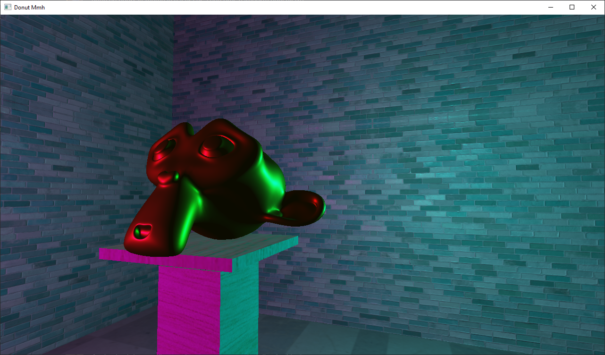
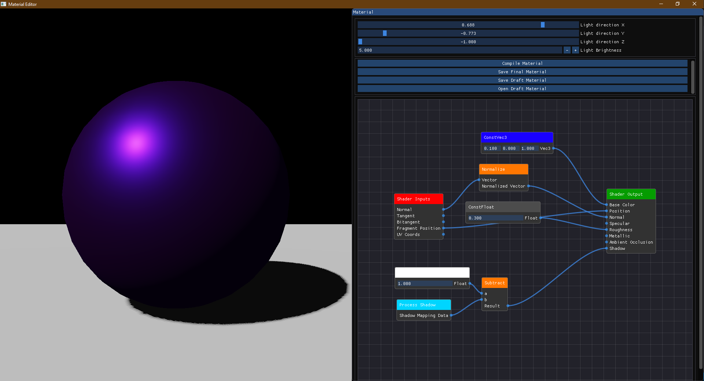
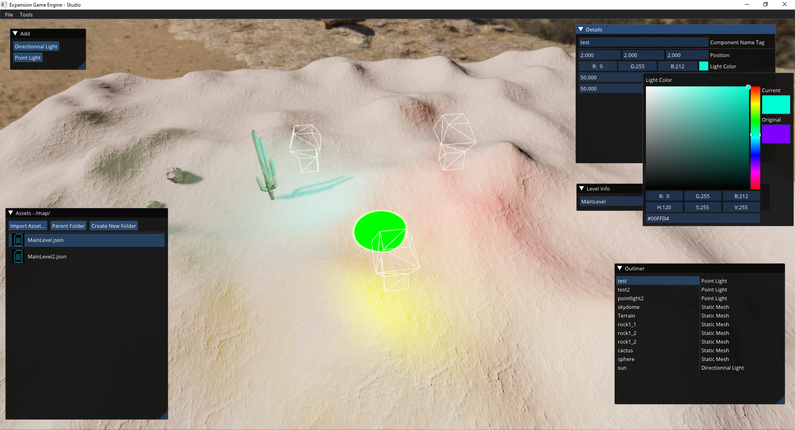
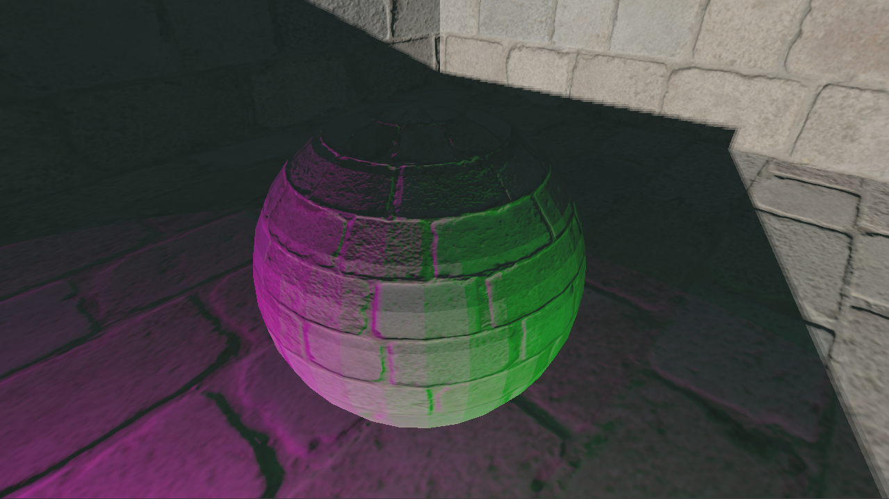
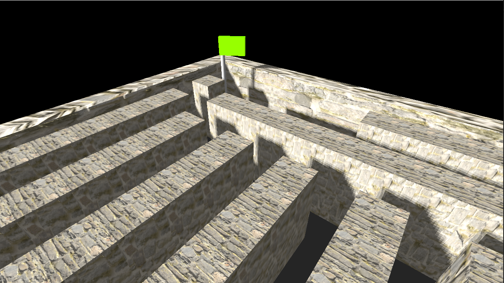

# ExpansionGameEngine

Expansion Game Engine is a 3D game engine under development.

## Target List
 - [ ] Multi-API rendering (OpenGL, Vulkan, and DirectX11/12 if I want to export to XBox)
   - [x] OpenGL 3/4
   - [ ] Vulkan (In priority to D3D, soon to be started)
   - [ ] Direct3D
 - [x] Going PBR
 - [x] Lightweight build (<30MB for all engine files) & SDK (<300MB for the whole sdk)
 - [x] Light and Shadow fully realtime
 - [x] Deffered rendering
 - [x] Cross-Platorm :
   - [x] Windows
   - [x] Linux
   - [ ] Console
     - [ ] Switch
     - [ ] PS4
     - [ ] XBox
   - [ ] Android
   - [ ] MacOS (last priority)
 - [ ] Optimise as f\*ck -> I want to have a very well optimised engine to run everywhere
 - [ ] An easy to understand & easy to use engine
     - [ ] JS **and** Python Scripting
     - [ ] Powerful all-in-one editor
     - [ ] Well written documentation

## Screenshots
Here you have some screenshots I took from the last demo I've made.

First demo of my PBR impl

Material Node Editor

Level Editor

A little Maze Generator I've built with EXPGE

## TODO List

 - [x] Impl. Shadows to Raindrop Renderer
   - [x] Improve these (for instance, better PCF)
 - [ ] Consistent error handling
 - [ ] Fix the error when reducing the window
 - [ ] Rewrite GUI system
 - [x] Rewrite Physics Integration (maybe switch to PhysX :thinking:)
 - [ ] Do Vulkan integration
 - [ ] Add particle system
      - [x] CPU Handled particles
      - [ ] GPU Handled particles
 - [ ] Starting the developpment of an editor & a good project manager 
     - [ ] Editor
     - [x] Project Manager
 - [ ] Solve the Stack Overflow on blitting multisample FBO (by implementing correctly MSAA tho)
 - [ ] Fix the CMakeLists to compile with PhysX

## Dependencies

### Main Engine deps

  - OpenAL Soft (by @Kcat)
  - GLFW3
  - OpenGL
  - GLAD (Packed with the repo)
  - GLEW
  - libsndfile1
  - PhysX (Packed with the repo)
  - Jsoncpp
 
### Tool deps

  - ASSIMP (For tools)
  - Qt (For tools)
  - imgui
  - imnodes (by Johann Muszynski)
 
NB1 : All libs that are precompiled and in this repo are compiled for Windows x64. If you want to compile this engine for Windows x86 you need to do it yourself. If you want to compile this engine for linux you'll need to install all the dependencies using your package manager.
 
NB2 : CMakeLists.txt are specially made for Linux, if you want to compile the engine for Windows, you can just use my Visual Studio solution (I usually update it at each VS major release, for now it is a VS2019 solution).
 
## License
This project is under CC-BY-NC-SA license.

For any question please contact me.
